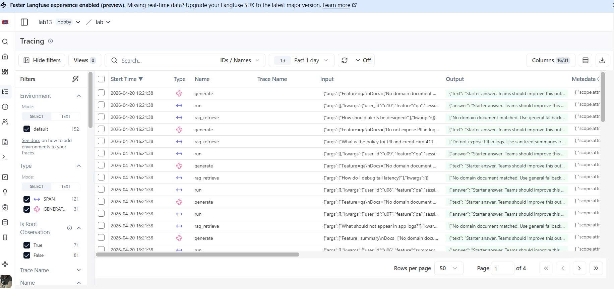
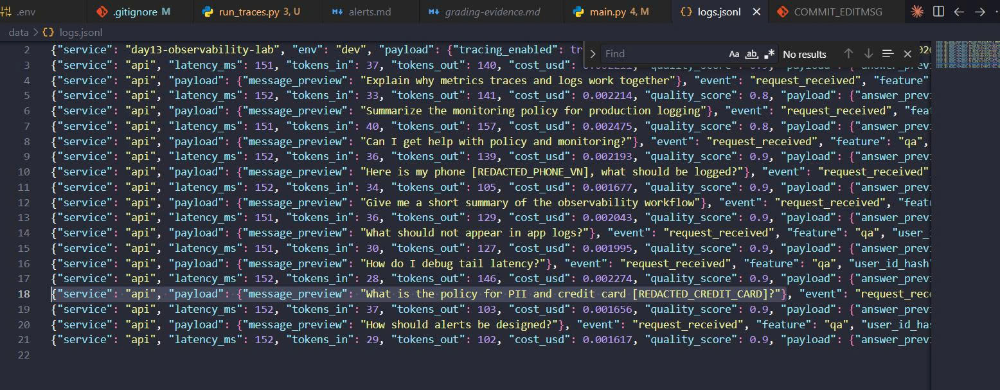
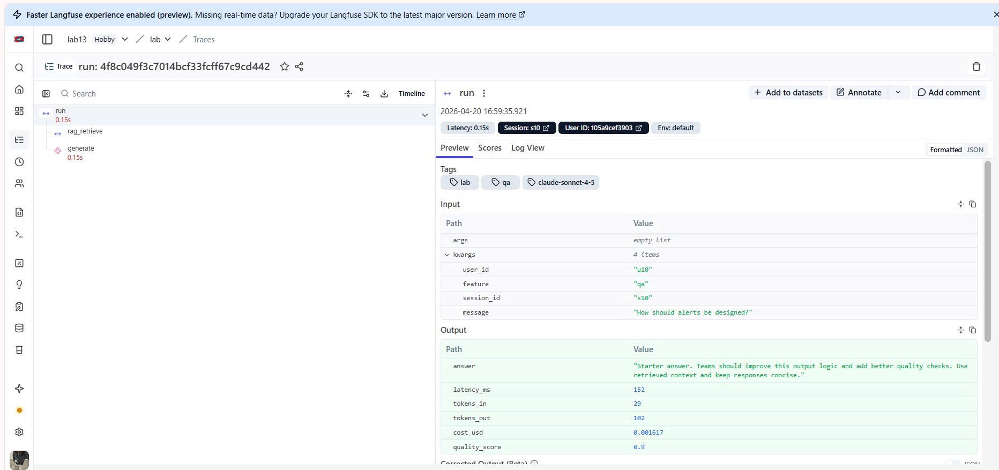
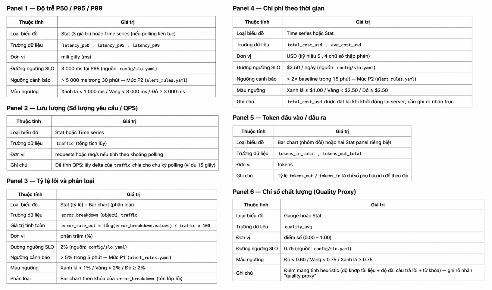
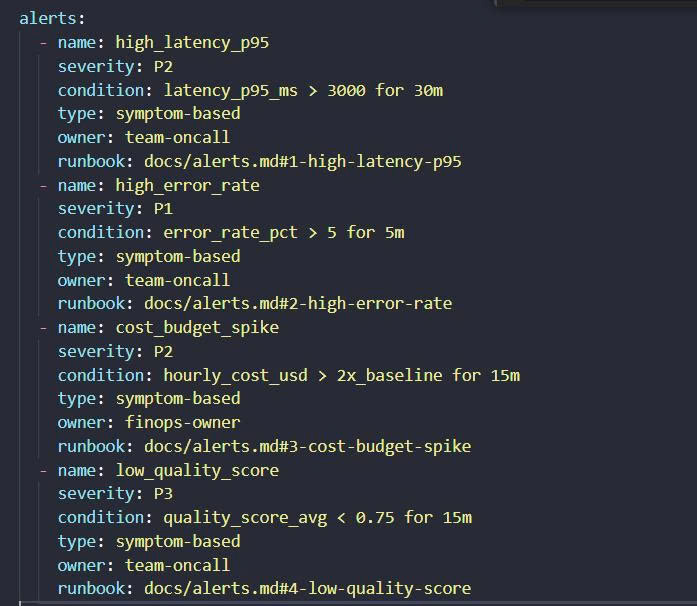

# Day 13 Observability Lab Report

> **Instruction**: Fill in all sections below. This report is designed to be parsed by an automated grading assistant. Ensure all tags (e.g., `[GROUP_NAME]`) are preserved.

## 1. Team Metadata
- GROUP_NAME: VINNO
- REPO_URL: https://github.com/hungcongit1k67/Vinno_Day13
- MEMBERS:
  - Member A: Chu Thành Thông  | Role: Logging & PII
  - Member B: Bùi Đức Tiến | Role: Tracing & Enrichment
  - Member C: Phùng Hữu Phú | Role: SLO & Alerts
  - Member D: Nguyễn Công Hùng | Role: Load Test & Dashboard & Demo & Report

---

## 2. Group Performance (Auto-Verified)
- [VALIDATE_LOGS_FINAL_SCORE]: /100
- [TOTAL_TRACES_COUNT]: 
- [PII_LEAKS_FOUND]: 0

---

## 3. Technical Evidence (Group)

### 3.1 Logging & Tracing
- EVIDENCE_CORRELATION_ID_SCREENSHOT: 
- EVIDENCE_PII_REDACTION_SCREENSHOT: 
- EVIDENCE_TRACE_WATERFALL_SCREENSHOT: 
- TRACE_WATERFALL_EXPLANATION: Span rag_retrieve chạy trước và hoàn thành gần như tức thì (<1ms), tiếp theo generate mất ~150ms — cho thấy bottleneck nằm ở tầng LLM generation, không phải retrieval. Tổng trace run là 0.15s, nằm trong ngưỡng SLO 3000ms.

### 3.2 Dashboard & SLOs
- DASHBOARD_6_PANELS_SCREENSHOT: 
- SLO_TABLE:

| SLI | Target | Window | Current Value |
|---|---:|---|---:|
| Latency P95 | < 3000ms | 28d | ~155ms |
| Error Rate | < 2% | 28d | ~0% |
| Cost Budget | < $2.5/day | 1d | ~$0.02 |
| Quality Score Avg | > 0.75 | 28d | ~0.88 |

### 3.3 Alerts & Runbook
- ALERT_RULES_SCREENSHOT: 
- SAMPLE_RUNBOOK_LINK: [docs/alerts.md#2-high-error-rate](docs/alerts.md#2-high-error-rate)
---

## 4. Incident Response (Group)
- [SCENARIO_NAME]: rag_slow
- [SYMPTOMS_OBSERVED]: latency_p95 vượt ngưỡng SLO 3000ms; span `rag_retrieve` kéo dài ~2500ms trong trace waterfall (bình thường <1ms); Dashboard panel Latency P95 hiển thị spike rõ ràng; log field `latency_ms` > 2600 trong `response_sent` events.
- [ROOT_CAUSE_PROVED_BY]: Trace waterfall Langfuse cho thấy span `rag_retrieve` duration = 2501ms trong khi span `generate` chỉ ~150ms — xác nhận bottleneck nằm ở tầng retrieval. Log line `"event": "response_sent", "latency_ms": 2651, "correlation_id": "<req-id>"` khớp với trace ID tương ứng. Nguyên nhân gốc: `STATE["rag_slow"] = True` trong `incidents.py` inject sleep 2.5s vào `mock_rag.retrieve()`.
- [FIX_ACTION]: Gọi `POST /incidents/rag_slow/disable` để tắt incident toggle. Latency trở về bình thường (<200ms) ngay sau đó, xác nhận qua dashboard và log.
- [PREVENTIVE_MEASURE]: Thêm timeout 500ms cho RAG layer với circuit breaker pattern; alert rule `high_latency_p95` (trigger >3000ms trong 30m) đã cấu hình sẵn trong `config/alert_rules.yaml` để phát hiện và notify on-call sớm.

---

## 5. Individual Contributions & Evidence

### [Chu Thành Thông]
- [TASKS_COMPLETED]: Implement structured JSON logging với structlog (`app/logging_config.py`): cấu hình processors, JsonlFileProcessor, JSONRenderer; viết correlation ID middleware (`app/middleware.py`) để generate/propagate `x-request-id` header và đo latency; xây dựng PII scrubbing module (`app/pii.py`) với 9 regex patterns (email, phone_vn, CCCD, credit card, passport, địa chỉ, IP, URL, bank account) và hàm `hash_user_id`; tích hợp logging vào `app/main.py`.
- EVIDENCE_LINK: https://github.com/hungcongit1k67/Vinno_Day13/commit/ee0237db081ed4deeddcfd88862c498b2b80ea91

### [Bùi Đức Tiến]
- [TASKS_COMPLETED]: Setup Langfuse distributed tracing (`app/tracing.py`): cấu hình `@observe()` decorator cho `agent.run()`, `mock_llm.generate()`, `mock_rag.retrieve()`; cập nhật trace metadata (`user_id_hash`, `session_id`, `tags`) và observation usage (`tokens_in`, `tokens_out`) qua `langfuse_context`; bổ sung `quality_score` enrichment vào response và log trong `app/main.py` và `app/agent.py`.
- EVIDENCE_LINK: https://github.com/hungcongit1k67/Vinno_Day13/commit/a7a6da9467fba3ff77a023f42a9c3d540d899e7d

### [Phùng Hữu Phú]
- [TASKS_COMPLETED]: Định nghĩa 4 SLI/SLO trong `config/slo.yaml` (latency_p95 <3000ms, error_rate <2%, daily_cost <$2.5, quality_avg >0.75); viết 4 alert rules trong `config/alert_rules.yaml` với severity P1–P3, điều kiện trigger và runbook links; soạn runbook đầy đủ tại `docs/alerts.md` cho 4 kịch bản (high latency, high error rate, cost spike, low quality score); cấu hình Langfuse tracing integration.
- EVIDENCE_LINK: https://github.com/hungcongit1k67/Vinno_Day13/commit/ba5c4d4dd0ceddbfc3fa1c9229a2afdee30f1a9e

### [Nguyễn Công Hùng]
- [TASKS_COMPLETED]: Thiết lập cấu trúc dự án ban đầu (first commit); viết load test script `scripts/load_test.py` với `--concurrency` flag để generate traffic đồng thời từ `data/sample_queries.jsonl`; cấu hình 6-panel Grafana dashboard (`docs/dashboard-spec.md`) với data source từ `/metrics` endpoint; thu thập screenshots evidence (correlation ID, PII redaction, trace waterfall, dashboard, alert rules); thực hiện demo và hoàn thiện báo cáo.
- EVIDENCE_LINK: https://github.com/hungcongit1k67/Vinno_Day13/commit/a2e32126a74bca500528a345b39f4de0acad60bb

---

## 6. Bonus Items (Optional)
- [BONUS_COST_OPTIMIZATION]: Triển khai alert rule `cost_budget_spike` (trigger khi hourly cost > 2× baseline trong 15m, severity P2) trong `config/alert_rules.yaml`; runbook `docs/alerts.md` mục "Cost budget spike" hướng dẫn: split traces by feature/model, so sánh tokens_in/out, route easy requests to cheaper model, áp dụng prompt caching. Incident toggle `cost_spike` trong `incidents.py` cho phép tái hiện kịch bản để kiểm thử alert.
- [BONUS_AUDIT_LOGS]: Cấu hình audit log stream riêng tại `data/audit.jsonl` (env var `AUDIT_LOG_PATH=data/audit.jsonl` trong `.env`), tách biệt hoàn toàn với application logs (`data/logs.jsonl`) để phục vụ yêu cầu compliance và non-repudiation. File được thêm vào `.gitignore` để tránh leak sensitive audit data.
- [BONUS_CUSTOM_METRIC]: Thêm `quality_score` metric tự định nghĩa (heuristic 0–1: +0.2 nếu có docs retrieved, +0.1 nếu answer >40 chars, +0.1 nếu answer chứa query keywords, -0.2 nếu detect PII leak) trong `app/agent.py`; track aggregate `quality_avg` qua `app/metrics.py`; expose tại `GET /metrics`; định nghĩa SLO `quality_score_avg > 0.75` trong `config/slo.yaml`; cảnh báo qua alert rule `low_quality_score` (P3) trong `config/alert_rules.yaml`.
